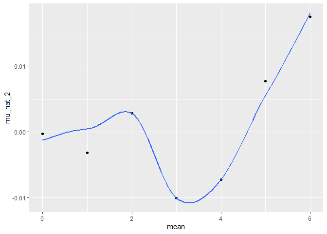
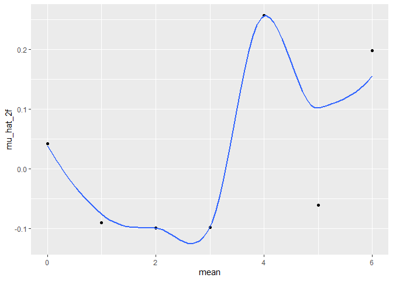

hw5_p8105
================
2024-11-11

## Problem 1

Not graded

## Problem 2

``` r
#test df
df1 = tibble(
  x = rnorm(30, mean = 0, sd = 5))

means = seq(0, 6, by = 1)

#test function
#need to add the return so the console display the result

df_sample = function(n, mean, sd) {
  data_1 = tibble(
    x = rnorm(n, mean, sd))
  data_result = t.test(data_1)
  
  return(data_result)
}

#you can run the function with the exact same n and sd and only change the mean
df_sample(30, 0, 5)
```

    ## 
    ##  One Sample t-test
    ## 
    ## data:  data_1
    ## t = 0.91439, df = 29, p-value = 0.3681
    ## alternative hypothesis: true mean is not equal to 0
    ## 95 percent confidence interval:
    ##  -0.8210168  2.1487627
    ## sample estimates:
    ## mean of x 
    ## 0.6638729

``` r
df_sample(30, 1, 5)
```

    ## 
    ##  One Sample t-test
    ## 
    ## data:  data_1
    ## t = 1.7696, df = 29, p-value = 0.0873
    ## alternative hypothesis: true mean is not equal to 0
    ## 95 percent confidence interval:
    ##  -0.2416066  3.3443870
    ## sample estimates:
    ## mean of x 
    ##   1.55139

``` r
#function: the dataset is part of the function because it's needed for repeated sampling
#the function is t.test directly
a_sample = function(a) {
  a_data = tibble(
    a = rnorm(30, mean = 0, sd = 5))
  a_result = t.test(a_data)
}

#writing loop
#use tidy as part of the output immediately to create a tibble
mean_0 = vector("list", length = 5000)

for (i in 1:5000) {
  mean_0[[i]] = tidy(a_sample())
}

#tidy dataframe result
result0 = bind_rows(mean_0) %>% 
  mutate(mean = "0") %>% 
  select(mean, estimate, p.value)

#repeat the above for mean = 1-6
#mean = 1
mean_1 = vector("list", length = 5000)

for (i in 1:5000) {
  mean_1[[i]] = tidy(a_sample(a(mean = 1)))
}

result1 = bind_rows(mean_1) %>% 
  mutate(mean = "1") %>% 
  select(mean, estimate, p.value)

#mean = 2
mean_2 = vector("list", length = 5000)

for (i in 1:5000) {
  mean_2[[i]] = tidy(a_sample(a(mean = 2)))
}

result2 = bind_rows(mean_2) %>% 
  mutate(mean = "2") %>% 
  select(mean, estimate, p.value)

#mean = 3
mean_3 = vector("list", length = 5000)

for (i in 1:5000) {
  mean_3[[i]] = tidy(a_sample(a(mean = 3)))
}

result3 = bind_rows(mean_3)  %>% 
  mutate(mean = "3") %>% 
  select(mean, estimate, p.value)

#mean = 4
mean_4 = vector("list", length = 5000)

for (i in 1:5000) {
  mean_4[[i]] = tidy(a_sample(a(mean = 4)))
}

result4 = bind_rows(mean_4) %>% 
  mutate(mean = "4") %>% 
  select(mean, estimate, p.value)

#mean = 5
mean_5 = vector("list", length = 5000)

for (i in 1:5000) {
  mean_5[[i]] = tidy(a_sample(a(mean = 5)))
}

result5 = bind_rows(mean_5)  %>% 
  mutate(mean = "5") %>% 
  select(mean, estimate, p.value)

#mean = 6
mean_6 = vector("list", length = 5000)

for (i in 1:5000) {
  mean_6[[i]] = tidy(a_sample(a(mean = 6)))
}

result6 = bind_rows(mean_6)  %>% 
  mutate(mean = "6") %>% 
  select(mean, estimate, p.value)

#How to include # of iterations and input mean in the tibble? mutate
#technically the df making (bind rows, mutate, and select) part can be included in a loop

#write a function to make the plot

#1st plot: Y = proportion of null rejected (p<0.05); x = the mean
#do i bind rows then filter, OR filter first then bind rows?

#bind rows first (make a master df)

masterdf = 
  bind_rows(result0, result1, result2, result3, result4, result5, result6) %>% 
  mutate(mean = as.numeric(mean))

#plot1
plot1 = masterdf %>% 
  filter(p.value < 0.05) %>% 
  count(mean) %>% 
  mutate(proportion = n/5000) 

#ggplot weirdly convert my df into list if i pipe directly, so i need to use the print function to display the plot. that's why i don't use piping. 
ggplot(plot1, aes(x = mean, y = proportion)) +
  geom_point()
```

<!-- -->

``` r
#describe the association between effect size and power
#In this simulation, out of 5000 only around ~250ish of all mean rejected the null hypothesis.
#This means that the effect size in majority of the simulations is small
#Because it's small, the power is small


#plot 2
plot2 = masterdf %>% 
  group_by(mean) %>% 
  summarize(mean(estimate)) %>% 
  rename(mu_hat_2 = `mean(estimate)`)

ggplot(plot2, aes(x = mean, y = mu_hat_2)) +
  geom_point() +
  geom_smooth(se = FALSE)
```

    ## `geom_smooth()` using method = 'loess' and formula = 'y ~ x'

<!-- -->

``` r
#plot 3
plot3 = masterdf %>% 
  filter(p.value < 0.05) %>% 
  group_by(mean) %>% 
  summarize(mean(estimate)) %>% 
  rename(mu_hat_2f = `mean(estimate)`)

ggplot(plot3, aes(x = mean, y = mu_hat_2f)) +
  geom_point() +
  geom_smooth(se = FALSE)
```

    ## `geom_smooth()` using method = 'loess' and formula = 'y ~ x'

<!-- -->

``` r
#the plot feels weird because there are - values. should i specify the data to be + only?

#how to overlap plot?

#-----
comp_plot = full_join(plot2, plot3)
```

    ## Joining with `by = join_by(mean)`

``` r
#is the sample average of mu hat across tests for which the null is rejected approximately equal to the true value of mean? why or why not? 
#no. actually the data from mu_hat_2 has the closer value to the true mean compared to the filtered one. this is because they have bigger sample size (5000 vs 250 ish)
```

## Problem 3

``` r
#export the data
homicide = read.csv("./data/homicide-data.csv")
```

Describe the raw data: The data contains 52179 observations. The
variables are uid, reported_date, victim_last, victim_first,
victim_race, victim_age, victim_sex, city, state, lat, lon, disposition,
which includes date of the crime (in YYYYMMDD format), victim’s name and
demographics, location of homicide, and the outcome of the
investigation.
