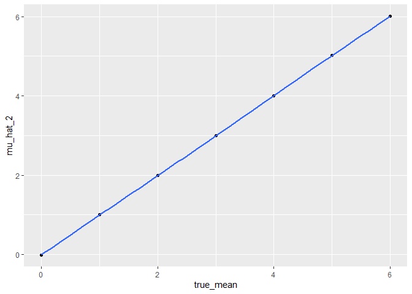
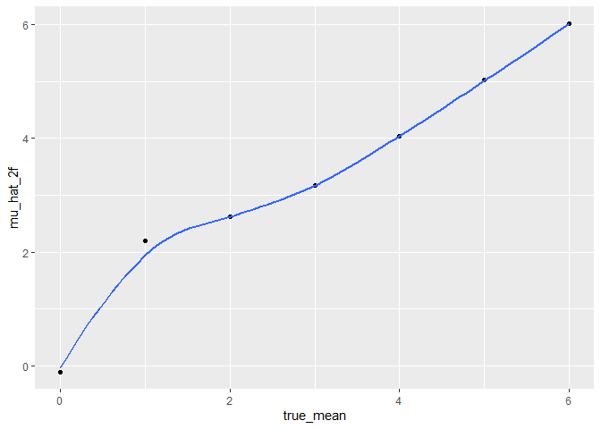

hw5_p8105
================
2024-11-11

## Problem 2

**2A. Design the elements**

``` r
#mu_values = 0:6
#for i in 1:length(mu_mean)
#define the length in the function not in the loop

#n = 30
#SD = 5
#mean = 0:6
#a = rnorm(30, mean = 0, sd = 5)
#include a in the function so it become repeated sampling, the function use t.test directly

ttest = function(n = 30, mean, sd = 5) {
  df1 = tibble(
    x = rnorm(n = n, mean, sd = sd))
  ttest_result = t.test(x ~1, df1)
  broom::tidy(ttest_result)
}

#writing loop
#use tidy as part of the output immediately to create a tibble
mean_0 = vector("list", length = 5000)

for (i in 1:5000) {
  mean_0[[i]] = ttest(mean = 0)
}

#tidy dataframe result
result0 = bind_rows(mean_0) %>% 
  print()
```

    ## # A tibble: 5,000 × 8
    ##    estimate statistic p.value parameter conf.low conf.high method    alternative
    ##       <dbl>     <dbl>   <dbl>     <dbl>    <dbl>     <dbl> <chr>     <chr>      
    ##  1    0.412     0.489  0.629         29   -1.31     2.14   One Samp… two.sided  
    ##  2    0.664     0.914  0.368         29   -0.821    2.15   One Samp… two.sided  
    ##  3    0.551     0.629  0.534         29   -1.24     2.34   One Samp… two.sided  
    ##  4    0.567     0.704  0.487         29   -1.08     2.21   One Samp… two.sided  
    ##  5   -1.65     -1.96   0.0599        29   -3.37     0.0731 One Samp… two.sided  
    ##  6    1.19      1.23   0.229         29   -0.786    3.16   One Samp… two.sided  
    ##  7    0.334     0.337  0.738         29   -1.69     2.36   One Samp… two.sided  
    ##  8   -1.19     -1.29   0.209         29   -3.08     0.703  One Samp… two.sided  
    ##  9    0.122     0.144  0.887         29   -1.62     1.86   One Samp… two.sided  
    ## 10    0.684     0.728  0.472         29   -1.24     2.60   One Samp… two.sided  
    ## # ℹ 4,990 more rows

**2B. Loop for mean 1-6**

``` r
#repeat the above for mean = 1-6, use map is easier
#y should not be part of the expand_grid. we shouldn't have 30 rows, we should have 5000 rows of random sampling containing 30 numbers.
mean_res = 
  expand_grid(
    true_mean = c(0, 1, 2, 3, 4, 5, 6),
    iter = 1:5000
  ) %>% 
  mutate(ttest_result = map(true_mean, ~ttest(mean = .x))) %>% 
  unnest(ttest_result) %>% 
  print()
```

    ## # A tibble: 35,000 × 10
    ##    true_mean  iter estimate statistic p.value parameter conf.low conf.high
    ##        <dbl> <int>    <dbl>     <dbl>   <dbl>     <dbl>    <dbl>     <dbl>
    ##  1         0     1    0.520     0.607   0.549        29   -1.23      2.27 
    ##  2         0     2    1.11      1.35    0.188        29   -0.574     2.80 
    ##  3         0     3    1.01      1.25    0.220        29   -0.635     2.65 
    ##  4         0     4   -0.835    -1.04    0.309        29   -2.48      0.815
    ##  5         0     5   -0.892    -0.920   0.365        29   -2.88      1.09 
    ##  6         0     6    0.557     0.678   0.503        29   -1.12      2.24 
    ##  7         0     7    1.04      1.21    0.238        29   -0.728     2.82 
    ##  8         0     8    1.40      1.50    0.144        29   -0.507     3.30 
    ##  9         0     9    1.15      1.37    0.180        29   -0.559     2.85 
    ## 10         0    10   -0.500    -0.481   0.634        29   -2.62      1.62 
    ## # ℹ 34,990 more rows
    ## # ℹ 2 more variables: method <chr>, alternative <chr>

**2C. Make plot for effect size**

``` r
mean_res %>% 
  mutate(
    estimate = as.numeric(estimate)
  ) %>% 
  select(true_mean, iter, estimate, p.value) %>% 
  group_by(true_mean) %>% 
  mutate(reject_null = p.value < 0.05) %>% 
  summarize(power = mean(reject_null)) %>% 
  ggplot(aes(x = true_mean, y = power)) +
  geom_point() +
  geom_smooth(se = FALSE)
```

    ## `geom_smooth()` using method = 'loess' and formula = 'y ~ x'

<!-- -->

**Describe the association between effect size and power**

As the hypothesized true population mean increased, so does the
difference with the sample mean. As effect size increase, power will
also increase as we can detect difference and thus reject the null.

**2D. Make plot for mu hat true mu**

``` r
#plot 2
plot2 = mean_res %>% 
  group_by(true_mean) %>% 
  summarize(mean(estimate)) %>% 
  rename(mu_hat_2 = `mean(estimate)`) 

ggplot(plot2, aes(x = true_mean, y = mu_hat_2)) +
  geom_point() +
  geom_smooth(se = FALSE)
```

    ## `geom_smooth()` using method = 'loess' and formula = 'y ~ x'

<!-- -->

``` r
#plot 3
plot3 = mean_res %>% 
  filter(p.value < 0.05) %>% 
  group_by(true_mean) %>% 
  summarize(mean(estimate)) %>% 
  rename(mu_hat_2f = `mean(estimate)`)

ggplot(plot3, aes(x = true_mean, y = mu_hat_2f)) +
  geom_point() +
  geom_smooth(se = FALSE)
```

    ## `geom_smooth()` using method = 'loess' and formula = 'y ~ x'

<!-- -->

**Is the sample average of mu hat across tests for which the null is
rejected approximately equal to the true value of mean? why or why
not?** No, as we see the line is not really linear. This is because when
the null is rejected, it means mu != mu hat so they should be different.

## Problem 3

**3A**

``` r
#export the data
homicide = read.csv("./data/homicide-data.csv")
```

**Describe the raw data** The data contains 52179 observations. The
variables are uid, reported_date, victim_last, victim_first,
victim_race, victim_age, victim_sex, city, state, lat, lon, disposition,
which includes date of the crime (in YYYYMMDD format), victim’s name and
demographics, location of homicide, and the outcome of the
investigation.

Create a city_state variable (e.g. “Baltimore, MD”) and then summarize
within cities to obtain the total number of homicides and the number of
unsolved homicides (those for which the disposition is “Closed without
arrest” or “Open/No arrest”).

``` r
homicide_clean = homicide %>% 
  unite(city_state, c(city, state), sep = ", ") %>% 
  group_by(city_state) %>%
  summarize(
    total = n(), 
    unsolved = sum(disposition != "Closed by arrest")) %>% 
  print()
```

    ## # A tibble: 51 × 3
    ##    city_state      total unsolved
    ##    <chr>           <int>    <int>
    ##  1 Albuquerque, NM   378      146
    ##  2 Atlanta, GA       973      373
    ##  3 Baltimore, MD    2827     1825
    ##  4 Baton Rouge, LA   424      196
    ##  5 Birmingham, AL    800      347
    ##  6 Boston, MA        614      310
    ##  7 Buffalo, NY       521      319
    ##  8 Charlotte, NC     687      206
    ##  9 Chicago, IL      5535     4073
    ## 10 Cincinnati, OH    694      309
    ## # ℹ 41 more rows

Total number of homicides and unsolved homicides across all city states
are 52179 and 26505, respectively.

**3B. Prop test for Baltimore**

``` r
library(broom)

#prop test for baltimore. x = unsolved, n = total homicide, the rest use default setting
homicide_clean %>% 
  filter(city_state == "Baltimore, MD") %>% 
  mutate(
    prop_test_result = map2(unsolved, total, ~ prop.test(x = .x, n = .y))
  ) %>% 
  mutate(
    tidy_result = map(prop_test_result, broom::tidy)
  ) %>% 
  unnest(tidy_result) %>% 
  select(city_state, estimate, conf.low, conf.high) %>% 
  print()
```

    ## # A tibble: 1 × 4
    ##   city_state    estimate conf.low conf.high
    ##   <chr>            <dbl>    <dbl>     <dbl>
    ## 1 Baltimore, MD    0.646    0.628     0.663

**3C. Prop test for all**

``` r
homicide_plot = homicide_clean %>% 
  mutate(
    prop_test_result = map2(unsolved, total, ~ prop.test(x = .x, n = .y))
  ) %>% 
  mutate(
    tidy_result = map(prop_test_result, broom::tidy)
  ) %>% 
  unnest(tidy_result) %>% 
  print()
```

    ## Warning: There was 1 warning in `mutate()`.
    ## ℹ In argument: `prop_test_result = map2(unsolved, total, ~prop.test(x = .x, n =
    ##   .y))`.
    ## Caused by warning in `prop.test()`:
    ## ! Chi-squared approximation may be incorrect

    ## # A tibble: 51 × 12
    ##    city_state      total unsolved prop_test_result estimate statistic   p.value
    ##    <chr>           <int>    <int> <list>              <dbl>     <dbl>     <dbl>
    ##  1 Albuquerque, NM   378      146 <htest>             0.386   19.1    1.23e-  5
    ##  2 Atlanta, GA       973      373 <htest>             0.383   52.5    4.32e- 13
    ##  3 Baltimore, MD    2827     1825 <htest>             0.646  239.     6.46e- 54
    ##  4 Baton Rouge, LA   424      196 <htest>             0.462    2.27   1.32e-  1
    ##  5 Birmingham, AL    800      347 <htest>             0.434   13.8    2.05e-  4
    ##  6 Boston, MA        614      310 <htest>             0.505    0.0407 8.40e-  1
    ##  7 Buffalo, NY       521      319 <htest>             0.612   25.8    3.73e-  7
    ##  8 Charlotte, NC     687      206 <htest>             0.300  109.     1.41e- 25
    ##  9 Chicago, IL      5535     4073 <htest>             0.736 1231.     1.28e-269
    ## 10 Cincinnati, OH    694      309 <htest>             0.445    8.11   4.41e-  3
    ## # ℹ 41 more rows
    ## # ℹ 5 more variables: parameter <int>, conf.low <dbl>, conf.high <dbl>,
    ## #   method <chr>, alternative <chr>

**3D. Homicide plotting**

``` r
homicide_plot %>% 
  select(city_state, estimate, conf.low, conf.high) %>% 
  arrange(desc(estimate)) %>% 
  mutate(city_state = fct_reorder(city_state, estimate)) %>% 
  ggplot(aes(x = city_state, y = estimate)) +
  geom_point() +
  geom_errorbar(aes(ymin = conf.low, ymax = conf.high)) +
  theme_bw() +
  theme(axis.text.x = element_text(angle = 90, hjust  =1))
```

<!-- -->
